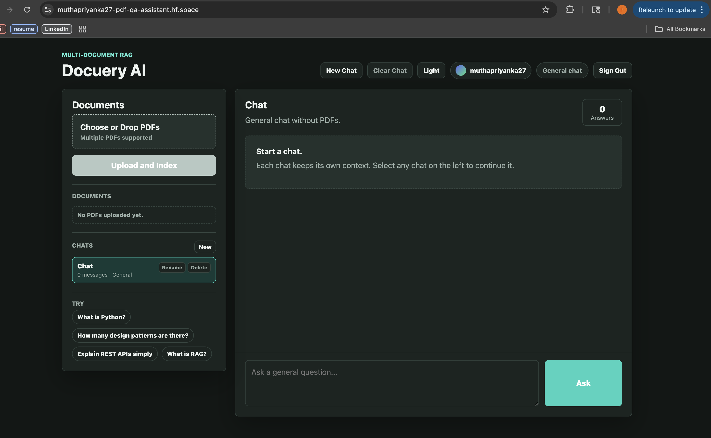

# Docuery AI

Docuery AI is a full-stack, multi-document RAG assistant that lets users upload
PDFs, ask natural-language questions, receive citation-backed answers, and keep
private chat/document history per signed-in user.

Live demo: [muthapriyanka27-pdf-qa-assistant.hf.space](https://muthapriyanka27-pdf-qa-assistant.hf.space)



## Highlights

- Multi-PDF upload with automatic parsing, chunking, embedding, and indexing.
- Retrieval-augmented answers with filename and page citations.
- General-question fallback when a question is not supported by uploaded PDFs.
- Hugging Face OAuth login for private, user-scoped document workspaces.
- Persistent SQLite chat sessions, messages, document collections, and auth sessions.
- ChromaDB vector search with per-user metadata filtering.
- Clear chat, rename chat, delete chat, and delete document flows.
- Dark/light responsive UI with a public Hugging Face Space deployment.

## Tech Stack

| Layer | Tools |
| --- | --- |
| Frontend | React, HTML, CSS |
| Backend | FastAPI, Pydantic, Uvicorn |
| RAG | LangChain, ChromaDB, Hugging Face embeddings |
| PDF Processing | PyPDF, LangChain text splitters |
| LLM Inference | Ollama |
| Persistence | SQLite, Chroma persistent storage |
| Auth | Hugging Face OAuth |
| Deployment | Docker, Hugging Face Spaces |

## Architecture

```text
User
  -> React UI
  -> FastAPI routes
  -> PDF parser + text splitter
  -> Hugging Face embeddings
  -> ChromaDB vector index
  -> Ollama LLM
  -> citation-backed answer

SQLite stores users, OAuth sessions, chat sessions, messages, and document
metadata. ChromaDB stores embedded PDF chunks with user/document metadata.
```

## Key Backend Features

- `POST /api/upload` uploads one or more PDFs and indexes their chunks.
- `POST /api/ask` routes questions through document retrieval or general LLM mode.
- `GET /api/state` returns only the signed-in user's documents and chats.
- `POST /api/sessions` creates a chat session.
- `PATCH /api/sessions/{session_id}` renames a chat or changes its document context.
- `DELETE /api/sessions/{session_id}/messages` clears a chat.
- `DELETE /api/sessions/{session_id}` deletes a chat.
- `DELETE /api/collections/{collection_id}` deletes a document collection and its vector chunks.
- `GET /api/auth/login` starts Hugging Face OAuth login.
- `POST /api/auth/logout` clears the auth session.

## Privacy Model

The deployed app uses Hugging Face OAuth. Each collection, document, chat
session, and retrieval query is scoped by `user_id`, so one signed-in user cannot
see another user's uploaded PDFs or chat history.

For local development, auth is relaxed by default and uses a local development
user. Set `REQUIRE_AUTH=true` to force the same auth behavior locally.

## Local Development

### 1. Backend

```bash
cd backend
python3 -m venv venv
./venv/bin/pip install -r requirements.txt
./venv/bin/uvicorn app.main:app --reload
```

Backend URL:

```text
http://127.0.0.1:8000
```

### 2. Frontend

The frontend is a lightweight React app served as static files.

```bash
cd frontend-simple
python3 -m http.server 5173
```

Frontend URL:

```text
http://127.0.0.1:5173
```

### 3. Ollama

Run Ollama locally and pull a model:

```bash
ollama pull llama3
ollama serve
```

Optional backend environment variables:

```bash
OLLAMA_URL=http://127.0.0.1:11434/api/generate
OLLAMA_MODEL=llama3
REQUIRE_AUTH=false
```

## Deployment

The project is Docker-ready for Hugging Face Spaces.

```bash
cd backend
./venv/bin/hf auth login

cd ..
backend/venv/bin/hf upload muthapriyanka27/pdf-qa-assistant . . \
  --repo-type space \
  --include "README.md" \
  --include "Dockerfile" \
  --include ".dockerignore" \
  --include "DEPLOYMENT.md" \
  --include "docker/**" \
  --include "backend/app/**" \
  --include "backend/requirements.txt" \
  --include "frontend-simple/**" \
  --exclude "backend/venv/**" \
  --exclude "backend/chroma_db/**" \
  --exclude "backend/*.sqlite3" \
  --exclude "frontend-simple/node_modules/**" \
  --exclude "**/__pycache__/**" \
  --exclude "**/*.pyc"
```

The Hugging Face Space metadata at the top of this README enables Docker and
OAuth:

```yaml
sdk: docker
app_port: 7860
hf_oauth: true
```

## Project Structure

```text
backend/
  app/
    routes/        FastAPI API routes
    services/      PDF parsing, chunking, embeddings, vector search, LLM calls
    storage/       SQLite persistence
frontend-simple/   React UI and CSS
docker/            Space startup script
Dockerfile         Hugging Face Spaces container
DEPLOYMENT.md      Deployment notes
```

## Resume Summary

Built a full-stack RAG document assistant with FastAPI, ChromaDB, LangChain,
Hugging Face embeddings, Ollama inference, Hugging Face OAuth, SQLite-backed
chat persistence, citation-backed answers, multi-PDF upload, and a responsive
React UI deployed on Hugging Face Spaces.
